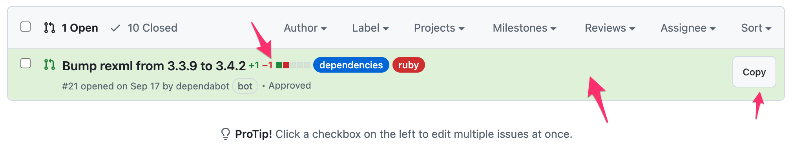

# Github Review Helper

Chrome extension to enhance pull request review experience with color coding, diffstat display, and quick copy functionality.

## Features

- **Color-coded PR status**: Visual indicators for review status
- **Diffstat display**: Shows file change statistics inline
- **Quick copy button**: Easily copy PR titles and links to clipboard

